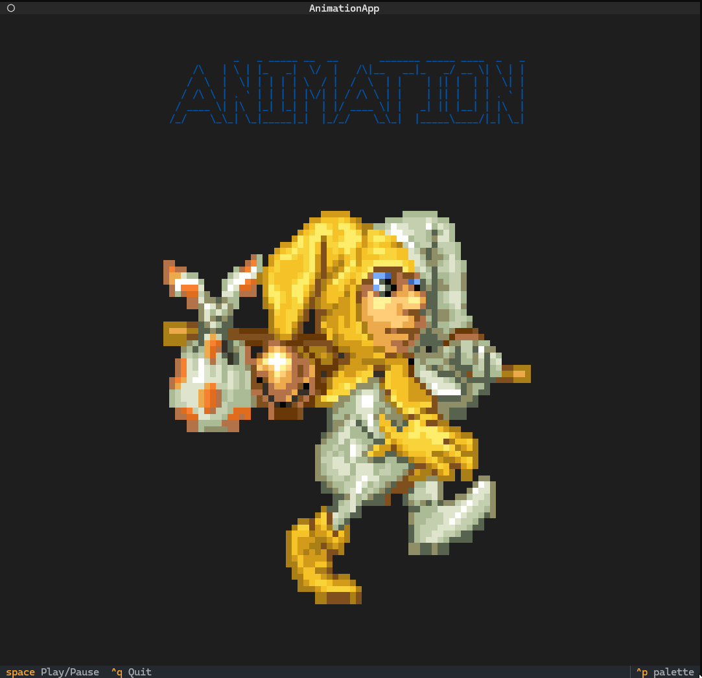

[](./README.md)
[](./README-PL.md)

# Terminal Animation Player

## Spis treści

- [Opis projektu](#opis-projektu)
- [Prezentacja projektu](#prezentacja-projektu)
- [Instalacja](#instalacja)
  - [Windows](#windows)
  - [Linux](#linux)
- [Instrukcja użytkownika](#instrukcja-użytkownika)
- [Główne funkcjonalności](#główne-funkcjonalności)
- [Rozwiązywanie problemów](#rozwiązywanie-problemów)

## Opis projektu

Terminal Animation Player to aplikacja konsolowa stworzona w języku Python, która umożliwia wyświetlanie animacji bezpośrednio w terminalu. Program wykorzystuje bibliotekę Textual do stworzenia interaktywnego interfejsu użytkownika w konsoli, wraz z obsługą dźwięku dzięki bibliotece Pygame. Animacje są wyświetlane w formie sekwencji obrazów PNG (64x64 piksele) z centralnym tytułem "ANIMATION" stworzonym przy pomocy ASCII art.

## Prezentacja projektu


### Kitty terminal


### Windows terminal



## Instalacja

### Wymagania systemowe

- Python 3.8 lub nowszy
- Pip (menedżer pakietów Pythona)

### Windows

1. Instalacja Pythona:

   - Pobierz i zainstaluj Python 3.8 lub nowszy ze strony [python.org](https://python.org)
   - Podczas instalacji zaznacz opcję "Add Python to environment variables"

2. Otwórz wiersz poleceń (cmd) jako administrator

3. Sklonuj repozytorium i przejdź do katalogu projektu:

```cmd
git clone <adres-repozytorium>
cd animation-in-terminal
```

4. Stwórz i aktywuj wirtualne środowisko:

```cmd
python -m venv venv
venv\Scripts\activate
```

5. Zainstaluj aplikację:

```cmd
pip install -e .
```

### Linux

1. Zainstaluj Pythona (jeśli nie jest zainstalowany):

- _Debian based distributions_ (na innych dystrybucjach należy użyć innego systemu zarządzania pakietami i odpowiadających pakietów)

```bash
sudo apt-get update
sudo apt-get install python3 python3-pip python3-venv git
```

2. Sklonuj repozytorium i przejdź do katalogu projektu:

```bash
git clone <adres-repozytorium>
cd animation-in-terminal
```

3. Stwórz i aktywuj wirtualne środowisko:

```bash
python3 -m venv venv
source venv/bin/activate
```

4. Zainstaluj aplikację:

```bash
pip install -e .
```

## Instrukcja użytkownika

### Uruchomienie aplikacji

Po instalacji możesz uruchomić odtwarzacz animacji na jeden z następujących sposobów:

1. Jeśli zainstalowano używając requirements.txt:

```bash
python main.py
# lub
python -m src.animation.app
# or
animate
```

### Sterowanie:

- `spacja` - Pauza/Wznowienie animacji
- `ctrl+q` - Wyjście z programu

## Główne funkcjonalności

- Wyświetlanie animacji w konsoli:
  - Wsparcie dla obrazów PNG 64x64
  - Płynne odtwarzanie z częstotliwością 10 FPS
- Obsługa dźwięku:
  - Efekty dźwiękowe przy zmianie klatki
  - Automatyczne zarządzanie systemem audio
- System logowania:
  - Zapis logów do pliku animation.log
  - Monitorowanie stanu aplikacji
  - Rejestrowanie błędów i zdarzeń

## Rozwiązywanie problemów

1. Problem z dźwiękiem:
   - Sprawdź czy plik step.wav znajduje się w odpowiednim katalogu (assets/sounds)
   - Upewnij się, że system audio działa poprawnie
2. Problemy z wyświetlaniem:
   - Sprawdź czy terminal obsługuje tryb kolorów 256
   - Upewnij się, że rozmiar terminala jest wystarczający
3. Błędy przy uruchamianiu:
   - Sprawdź czy wszystkie zależności są zainstalowane
   - Zweryfikuj poprawność ścieżek do plików
